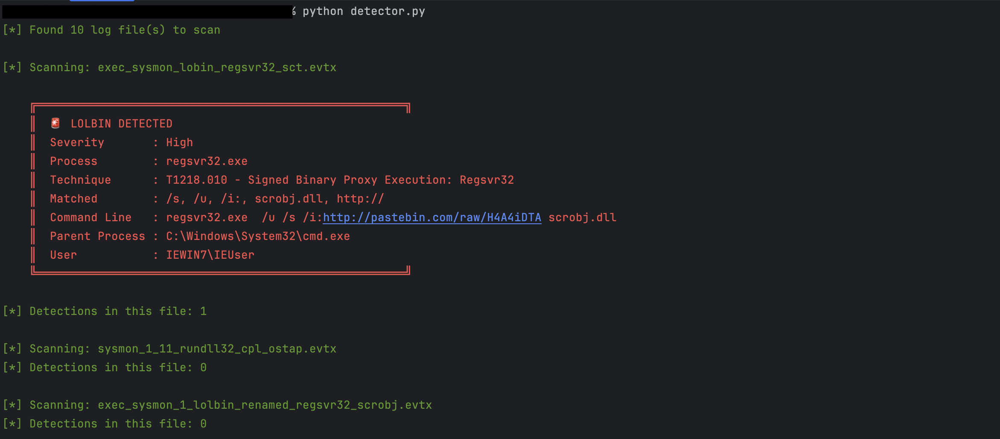
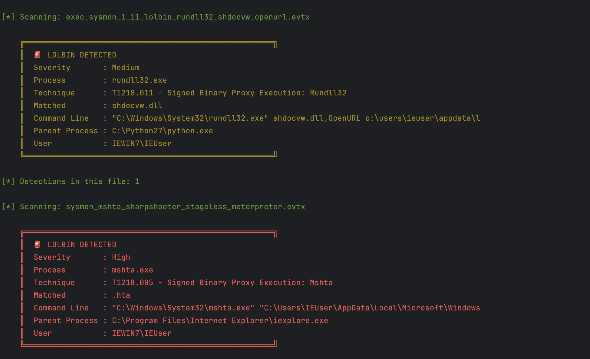
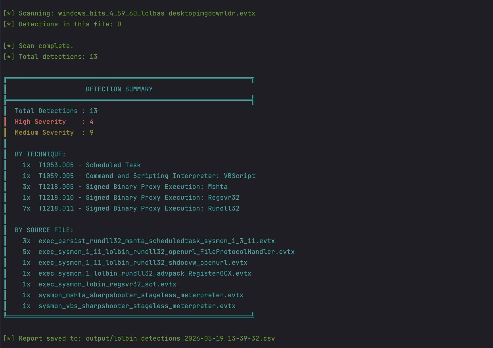

# 🛡️ LOLBin Detector
A Python tool that scans Windows log files and alerts you when an attacker is using built-in Windows programs to do something malicious, a technique known as "Living off the Land."

## 🧠 TL;DR
This is a Python tool that reads Windows log files and catches attackers who are hiding behind legitimate Windows programs. It covers 21 commonly abused binaries, maps every detection to the MITRE ATT&CK framework, and saves results to a CSV report.

## 🔍 The Problem This Solves
When attackers get into a Windows machine, they often avoid bringing their own hacking tools because antivirus might catch them. Instead they use programs that are already on every Windows computer - things like certutil.exe, rundll32.exe, and mshta.exe, and abuse them in ways Microsoft never intended.

This is called Living off the Land and it is one of the hardest attack techniques to detect because the programs themselves are completely legitimate. Windows trusts them. Antivirus trusts them. But a skilled attacker can use them to download malware, run malicious code, or take over a machine without ever installing anything suspicious.
This tool detects exactly that kind of abuse.

## ⚙️ How It Works
You give it a Windows log file. It reads through every recorded process event and asks a simple question for each one:

> "Is this a program we know attackers abuse, and does the command look suspicious?"

If the answer is yes, it fires an alert showing you exactly what happened, who ran the command, what their parent process was, and which known attack technique it maps to.

At the end it saves a full report to a CSV file you can open in Excel or Google Sheets.

## 🎯 What It Detects
The tool currently covers 21 Windows binaries that are commonly abused by attackers. Some are;

#### 1. Execution (Programs used to run malicious code)

- regsvr32.exe — normally registers software components, abused to run remote malicious scripts (a technique called Squiblydoo)
- mshta.exe — normally runs HTML applications, abused to download and execute attacker payloads
- rundll32.exe — normally loads program functions, abused to run JavaScript and open remote files
- powershell.exe — abused to download and run malware entirely in memory, leaving almost no trace on disk

#### 2. Ingress Tool Transfer (Programs used to download malware)

- certutil.exe — normally manages security certificates, abused to download files from the internet
- bitsadmin.exe — normally handles Windows Update downloads, abused for silent malware delivery
- desktopimgdownldr.exe — normally downloads desktop wallpapers, abused to pull down malicious files

#### 3. Defense Evasion (Programs used to cover tracks)

- vssadmin.exe — normally manages backups, abused by ransomware to delete all backup copies before encrypting files
- wevtutil.exe — normally manages Windows event logs, abused to wipe the logs and destroy evidence

#### 4. Persistence (Programs used to stay on the machine)

- schtasks.exe — abused to create hidden scheduled tasks that run malware every time the machine starts
- sc.exe — abused to install a malicious program as a Windows service so it survives reboots
- reg.exe — abused to add malicious programs to the registry so they run automatically on login

Every detection includes the exact MITRE ATT&CK technique ID.

## 📁 Project Structure
lolbin-detector/
- **📂 logs/**             - Put your .evtx Windows log files here
- **📂 output/**           - Detection reports are saved here automatically
- **📄 rules.py**          - All detection rules live here
- **📄 detector.py**       - The main engine that reads logs and finds threats
- **📄 report_maker.py**   - Saves results and prints the summary

> 💡 One of the key design decisions was keeping the rules completely separate from the detection logic. This means adding a new binary to detect is as simple as adding a few lines to rules.py, nothing else needs to change. The tool currently covers 21 binaries and can scale to hundreds without any changes to the core logic (detector.py).

## 🚀 How to Run It

Step 1 — Install the required libraries

    pip install python-evtx pandas colorama

Step 2 — Drop your log files in

  Copy your .evtx Windows event log files into the logs/ folder.

Step 3 — Run the detector

    python detector.py

Step 4 — Check your results

  Alerts print to the terminal as they are found:

  - 🔴 Red — High severity, immediate attention recommended
  
  - 🟡 Yellow — Medium severity, analyst review recommended

A full report is automatically saved to output/ as a timestamped CSV file.

## Test Output
This is what a real detection looks like, caught during testing against a real attack log:

Output:

> 💾 Note: Every scan automatically saves a timestamped CSV report to the __*output/*__ folder. Open it in Excel or Google Sheets to filter, sort, and share your findings

## 🔧 Dealing With False Positives
A false positive is when the tool fires an alert on something that looks suspicious but is actually normal and harmless. During testing two false positives were found and fixed:

#### 1. Problem 1 — regsvr32 and the /s flag
The /s flag tells regsvr32 to run silently without showing any popups. At first the tool flagged any regsvr32 command containing /s — but it turned out that software installers use this flag constantly during completely normal operation. Flagging it alone would flood a real SOC with noise.
The fix was simple: /s alone no longer triggers an alert. It only counts as suspicious when it appears alongside something else that is genuinely concerning — like a remote URL or the scriptlet engine.

#### 2. Problem 2 — rundll32 and shell32.dll
The tool initially flagged any rundll32 command involving shell32.dll. The problem is that Windows itself calls shell32.dll hundreds of times a day to operate the Control Panel, file explorer, and right-click menus. Flagging it broadly caught a huge amount of completely normal Windows activity.
The fix was to narrow the rule to only the specific functions inside shell32.dll that are known to be abused by attackers — leaving all the legitimate Windows behaviour untouched.

## ⚠️ Known Limitations
Here are three things this tool currently misses and why:

#### 1.  Renamed binaries
The tool identifies programs by their filename. If an attacker renames regsvr32.exe to windowsupdate.exe before running it, the tool will not catch it. One of the test log files demonstrated this exact scenario, a renamed regsvr32 attack produced zero detections.
*A future improvement would be to match binaries by their file hash instead of just their name since the file contents and therefore the hash stay the same even if the name changes.

#### 2.  Non-Sysmon log formats
This tool is built specifically for Sysmon process creation logs. Some attack techniques get recorded in different Windows log formats. For example, BITS download activity is recorded in its own event log, not in Sysmon. Those events are currently invisible to this tool.

#### 3.  Obfuscated command lines
Sophisticated attackers sometimes add special characters to their commands to confuse detection tools while still making the command work when Windows executes it. For example ce^r^tutil runs as certutil in practice but does not match the pattern certutil in a log. Handling obfuscation properly is a more advanced detection challenge.

## 🧩 Adding New Rules
To add a new LOLBIN, add one entry to **_rules.py_**:

    "newbinary.exe": {
          "technique_id": "T1XXX.XXX",
          "technique_name": "MITRE Technique Name",
          "severity": "High",
          "suspicious_patterns": [
                  "suspicious_flag",
                  "http://",
                  "malicious_pattern"
          ]
    }

## 📚 What I Learned Building This

- How Windows event logs are structured and how Sysmon enriches them with security-relevant detail
- Why behavioral detection is more effective than signature-based detection for advanced threats
- How the MITRE ATT&CK framework organises and categorises real-world attacker techniques
- How to identify and tune false positives without removing legitimate detections
- Why separating detection rules from detection logic matters for long-term maintainability
- How attackers use renamed binaries and obfuscation to evade exactly the kind of tool I built

## 🔗 Resources

- [LOLBAS Project](https://lolbas-project.github.io/) — database of every known living off the land binary
- [MITRE ATT&CK](https://attack.mitre.org/) — the framework used to categorise every detection in this tool
- [EVTX Attack Samples](https://github.com/sbousseaden/EVTX-ATTACK-SAMPLES) — the real attack logs used to test this tool
- [Sysmon](https://learn.microsoft.com/en-us/sysinternals/downloads/sysmon) — the Windows monitoring tool that generates the logs this tool reads

